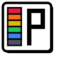

<h1> TierPix   </h1>

built a random image tier list generator because i was bored over the weekend lol.

it fetches random open-licensed images from Openverse & Wikimedia Commons so you can rate them S/A/B/C/D/F instantly.

##  features

- **instant zero-lag swaps**: fast web preloading so image changes are instant
- **drag & drop**: drag any stage image straight into any tier row
- **keyboard shortcuts**: hit `S`, `A`, `B`, `C`, `D`, `F` or `1`-`6` to rate, press `Space` to skip
- **sound & sparkles**: retro Web Audio chimes and canvas particle pops
- **chaos & abyss modes**: random weirdcore, liminal, and rare image drops
- **export**: download your tier list as json

##  license

MIT License (this code) — feel free to fork it, break it, and build cool stuff!

Images are fetched live and keep their original licenses from [Openverse](https://openverse.org/) and [Wikimedia Commons](https://commons.wikimedia.org/).

##
 
Assisted by AI

